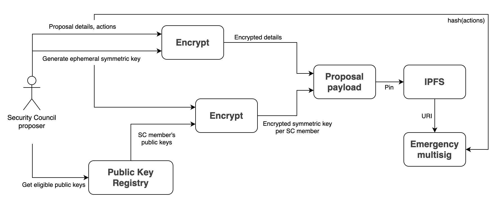
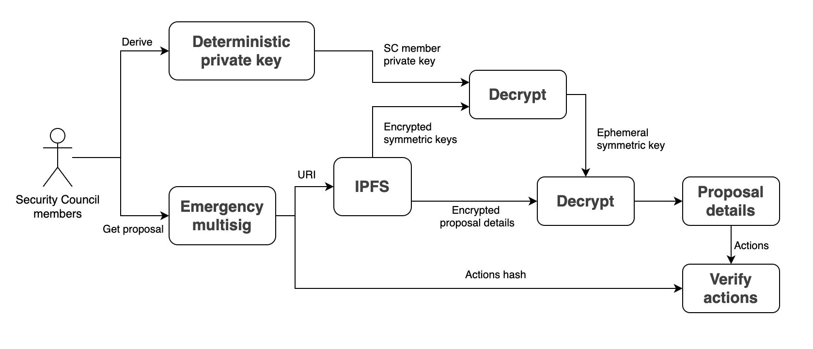

# Taiko DAO UI

## Overview

This project is the combination of a host UI including common tools and services, which features 4 UI modules:

### Proposal section

This section displays all the proposals which need to be ratified by the community of token holders. Proposals follow an optimistic governance flow. They created by the Taiko Council and token holders have the chance to veto them for a certain amount of time.

This flow attempts to find a good balance between efficiency, agility, prevent spam or attacks and decentralization. 

### Taiko Council

This section features a multisig plugin which is only visible to Taiko Council members. It allows to create, approve and eventually relay proposals to the community section described above. 

### Security Council

This section is also a multisig plugin, with the difference that a super majority of the Security Council can approve and execute proposals that are time critical. This plugin may be disabled in future iterations of the DAO but for the time being, it allows respond to potential security threats in a much quicker way. 

The metadata and the actions of the proposal are encrypted until the proposal has been executed. See [Encryption and decryption flows](#encryption-and-decryption-flows) below.

### Members section

This section shows a recap of the delegates who publish an announcement, as well as the Security Council members. Delegates can use this section to create their own profile while token holders can browse delegates and can eventually delegate to a candidate of their trust.

## Encryption and decryption flows

In proposals where metadata needs to be kept private until the end, we implement a two-layer encryption model which combines symmetric and asymmetric keys.

The data that we need to encrypt includes:
- **Human readable data**, explaining why the proposal should be approved
- The **actions to execute** if the proposal passes

### Encryption steps

1. A user signs a static payload using his/her wallet. The resulting hash is used as a 256-bit private key to generate an ephemeral, in-memory key pair
2. One of the multisig members generates a random symmetric key and uses it to encrypt the metadata and the actions
3. The member fetches the public keys corresponding to the current Security Council members
4. For each member's public key, he uses it to encrypt the key from step (1)
5. This generates a payload with:
  - The (symmetrically) encrypted metadata and proposals
  - The (asymmetrically) encrypted keys that only each member can recover
6. The payload is pinned on IPFS
  - The IPFS URI is published as the proposal metadata
  - The hash of the unencrypted metadata is also published as part of the proposal



### Encryption steps

1. One of the multisig members fetches the proposal, along with the pinned IPFS metadata
2. The member signs the same predefined payload to generate the in-memory key pair
3. The user locates the key that was encrypted for his/her wallet
4. He then uses it as the symmetric key to decrypt the metadata and the proposal actions



## Getting Started with the UI

Before you start, make sure you have Bun installed on your machine. If not, hop over to [Bun's official documentation](https://bun.sh/) for installation instructions.

Once you're set with Bun, clone this repository to your local machine:

```bash
git clone https://github.com/your-repo/aragonette.git
cd aragonette
```

To get the development server running, simply execute:

```bash
bun install
bun dev
```

## Adding Your Plugin 🧩

Got a plugin idea that's going to revolutionize the Aragon ecosystem? Adding it to Aragonette is as easy as pie:

1. **Duplicate a Plugin Directory**: Navigate to the `/plugins` directory, pick a plugin that closely resembles your idea, and duplicate its directory.
2. **Rename Your Plugin**: Give your plugin a unique and catchy name that captures its essence.
3. **Register Your Plugin**: Open the `index.tsx` file inside the `/plugins` directory and add an entry for your new plugin.

And that's it! Your plugin is now part of the Aragonette universe. 🌌

## Leveraging Aragon OSx Primitives 🛠

Aragonette is built to work seamlessly with Aragon OSx primitives, such as `IProposal` or `MajorityVoting`. This means you can focus on the fun part of creating and experimenting, without sweating the small stuff. Your plugin should integrate smoothly into the UI, making your development journey as breezy as a blockchain. 😉

## Contributing 🤝

Got ideas on how to make Aragonette even better? We're all ears! Whether it's a bug fix, a new feature, or a plugin that could benefit everyone, we welcome your contributions. Check out our [contributing guidelines](CONTRIBUTING.md) for more information on how to get involved.

### You can configure your repository to pull changes from this repository with:

```bash
git remote add upstream git@github.com:aragon/aragonette.git
git remote set-url --push upstream DISABLE
```

## Need Help? 🆘

Stuck on something? Our community is here to help! Join our [Discord channel](https://discord.com/invite/eqQJkdp) for support, advice, or just to share your awesome plugin creations with fellow Aragon enthusiasts.

## License 📜

Aragonette is released under the AGPL v3 License.

---

Happy prototyping! With Aragonette, the future of decentralized organizations is in your hands. Let's build something amazing together! 🚀🌈
